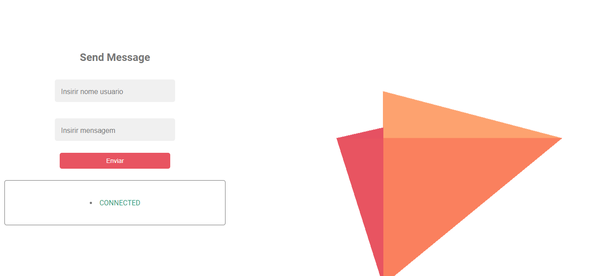

# Websocket app

>Clients server chat example, one client sends a message to the server and the server broadcast this message to all connected clients at moment, just like a real time group chat.

## Refeerences
[MDN web Docs WebSockets](https://developer.mozilla.org/en-US/docs/Web/API/WebSockets_API/Writing_WebSocket_client_applications)

[Securityy in websocket Considerations - RFC 6455 Capter 10](https://datatracker.ietf.org/doc/rfc6455/?include_text=1)

**Websocket Implementations**

[ws: a Node.js WebSocket library](https://github.com/websockets/ws)

[ClusterWS Build Scalable Node.js WebSocket Applications](https://github.com/ClusterWS/ClusterWS/wiki)

## Notes

### 

Read the latest official **WebSockets specification**,**RFC 6455**. Sections 1 and 4-7 are especially interesting to server implementors. Section 10 discusses **security** and you should definitely peruse it before exposing your server.

### 

All browsers send an Origin header. You can use this header for security (checking for same origin, automatically allowing or denying, etc.) and send a **403 Forbidden** if you don't like what you see. However, be warned that non-browser agents can send a faked Origin. Most applications reject requests without this header.

### 

**Keeping track of clients**

you might keep a table of usernames or ID numbers along with the corresponding WebSocket and other data that you need to associate with that connection.

